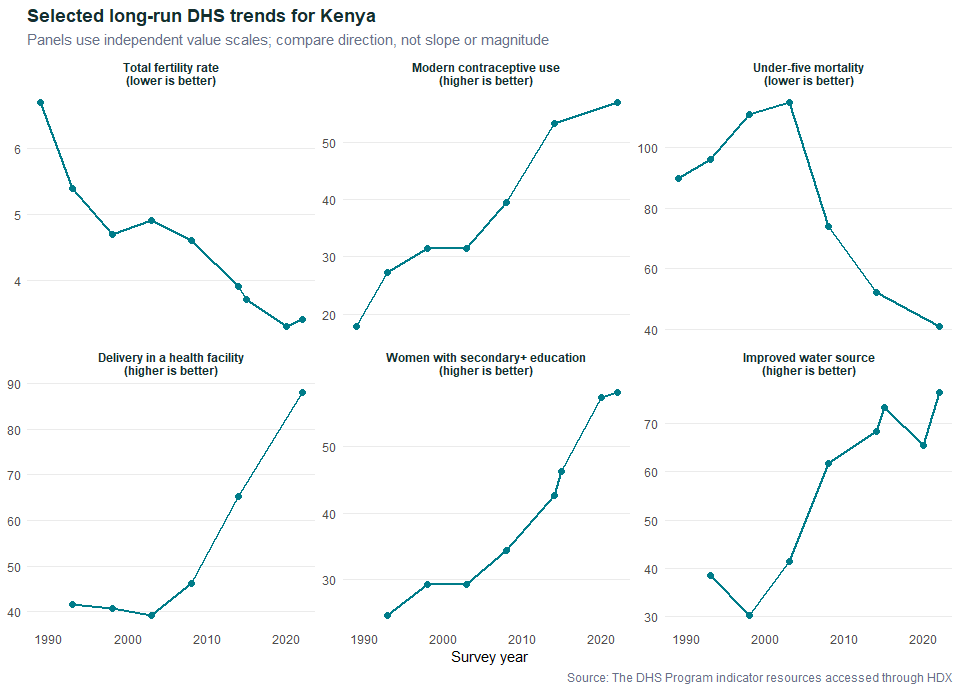

<!-- README.md is generated from README.Rmd. Please edit that file -->

# kenyaIndicators

<!-- badges: start -->

[](https://github.com/m-mburu/kenyaIndicators/actions/workflows/download_data.yaml)
<!-- badges: end -->

The purpose of this package is to make Kenya’s Demographic and Health
Survey (DHS) indicators easier to explore and interpret. It brings
long-run evidence on fertility, child survival, health services, HIV,
malaria, education, gender and household conditions into one Shiny
dashboard. The indicators were obtained from the [Humanitarian Data
Exchange](https://data.humdata.org/) and originate from [The DHS
Program](https://dhsprogram.com/).

The app is hosted on shinyapps.io and can be accessed
[here](https://mmburu.shinyapps.io/kenyaIndicators/).

## What the dashboard is for

The dashboard connects a curated group of DHS indicators to the
Sustainable Development Goals. The first page provides a quick view of
the direction of the main trends. We can then select one indicator and
read the survey years, published values, source, uncertainty
availability and interpretation notes.

The full indicator catalogue is also included. This makes it possible to
move from the policy overview to the published national series without
presenting DHS data as a complete measure of Kenya’s development.

## Selected national DHS trends

The plot below shows six of the indicators used in the overview. Each
panel uses the indicator’s original unit and its own value scale. We
should therefore compare the direction of the trends and not the
steepness of one line with another.



## Last run report

This report is produced when `README.Rmd` is knitted. The scheduled
GitHub workflow refreshes the data, runs the tests and package check,
knits this README, commits the generated files and deploys the app.

| Item                                   |               Result |
|:---------------------------------------|---------------------:|
| README generated                       | 2026-07-22 11:35 EAT |
| Latest DHS survey year                 |                 2022 |
| Curated overview indicators            |                   16 |
| Indicators with repeated survey rounds |                   15 |
| Indicators in the full catalogue       |                 1196 |

## Reading the overview

The first page is meant to be read quickly. The summary boxes filter the
small trend charts by SDG theme or status. Each chart shows whether the
indicator is improving, worsening or requires closer interpretation. It
also states whether a higher or lower value is desirable.

When we hover over a trend we see its latest value and year. When we
select it, the dashboard opens the full survey-year chart and the
evidence details. The reading path is:

**Scan the shapes -\> identify the status -\> check the latest value -\>
open the full evidence.**

## Status and interpretation

Status is calculated from the change between the first and latest
available values in the curated national series. The direction is
reversed for indicators such as mortality, unmet need and violence,
where a lower value is desirable. A change of less than two percent from
the baseline is labelled as little change.

An improving status does not mean that Kenya has reached an SDG target.
It only means that the indicator moved in the desired direction over the
survey years available. The status should be read together with
confidence intervals, survey coverage and other indicators in the same
policy area.

## Installation

You can install the development version of kenyaIndicators from
[GitHub](https://github.com/) with:

``` r
# install.packages("remotes")
remotes::install_github("m-mburu/kenyaIndicators")
```

## Running the dashboard

After installing the package, run:

``` r
library(kenyaIndicators)

run_app()
```

The project can also be run from the repository:

``` r
shiny::runApp()
```

## What is included

The dashboard has three main sections:

- **Overview** presents the curated SDG evidence as interactive small
  multiples.
- **Explore indicators** shows a fully labelled national trend for a
  selected indicator.
- **Evidence coverage** reports data quality, provides the indicator
  catalogue and identifies questions which require other datasets.

The package includes `dhs_indicators`, `indicator_catalogue`,
`dashboard_timeline`, `hypothesis_map` and `kenya_counties` as its main
data objects.

## Evidence limitations

DHS data is collected in survey rounds rather than every year. A line
between two survey years is a visual connection and not an estimate for
the years between them. Some indicators have confidence intervals and
denominators while others do not. The Evidence coverage section makes
these differences visible.

The overview uses national series so that the first reading remains
clear. National estimates can hide differences between counties and
population groups. Questions on income, employment, climate,
infrastructure and institutions also require companion datasets.

## Development

The application is organised as a golem package. The user interface is
in `R/app_ui.R`, server logic is in `R/app_server.R`, plotting functions
are in `R/plots.R`, and source-data preparation is in
`data-raw/my_dataset.R`.

``` r
devtools::test()
devtools::check()
rmarkdown::render("README.Rmd", output_format = "github_document")
```

## Acknowledgements

- **The DHS Program** for collecting and publishing Kenya’s demographic
  and health survey evidence.
- **Humanitarian Data Exchange (HDX)** for making the national indicator
  resources easier to access.
- **Kenya National Bureau of Statistics and survey partners** for
  producing the underlying survey data.
